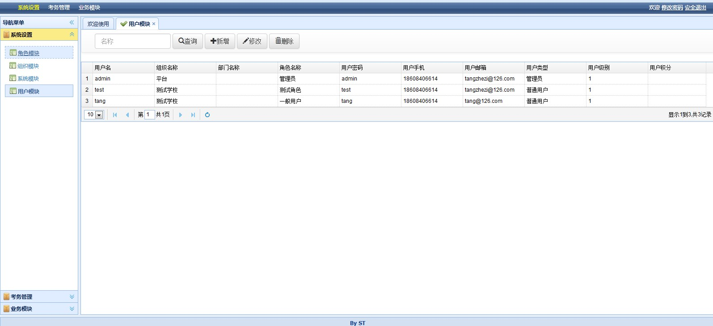

## 考试汤的第一篇:目标与介绍

#### 考试汤的目标：
##### 1.做一个简单，方便的开源的在线考试平台。
##### 2.欢迎有朋友加入进来，一起改善它。

#### 考试汤的介绍
##### 1：技术：前台采用bootstrap3 extjs html， 后台采用springmvc+mybatis 
##### 2：目前完成权限、试卷生成、考题添加、考试。

放个图片：
1.系统管理--用户管理

2.考务管理--考卷编辑1

考务管理--考卷编辑2

考务管理--考试

* 考试汤适用于个人学习，商业使用请联系我。

> 生活中的每一个微笑都不要放过，转身后，彼此不见。

